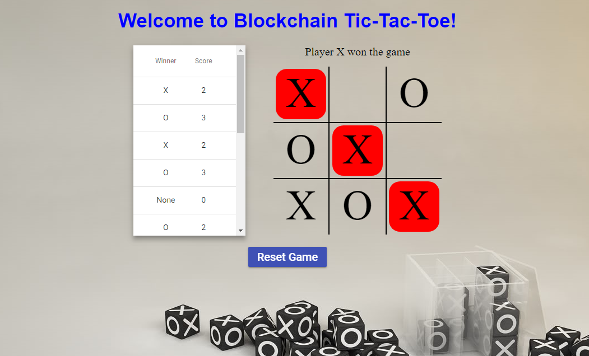

# Blockchain Tic-Tac-Toe

This is a small blockchain project I undertook to learn more about blockchain technology while building an application in technologies such as Angular, Express and Pusher API.

### Purpose

It is meant to be a simple tic-tac-toe game but using some of blockchain's notable features to create a more secure and fascinating version of this game. The game connects two players live to play (using the same URL) a fun game of tic-tac-toe.

### How it's created

The game is built using Angular and built on top of a custom blockchain I developed myself to save and check the validity of game results in the history. Express is used to create a serve on which the Angular app and Pusher API could be served on. The Pusher API is used to broadcast events to the websocket and retrieve information regarding moves made by the other play. 

## Web App Screenshot

